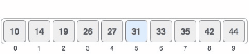

### 5.12 - Synthesis: Arrays of Hashes

- 1. Start with the array of hashes:
- 2. Create a new array of hashes called great_movies which only contains movies with a rating greater than 3 and where each hash contains only the title and boxart information. 
- The result should be:
~~~
[
  {
    "title"=>"Die Hard",
    "boxart"=>"http://cdn-0.nflximg.com/images/2891/DieHard.jpg"
  },
  {
    "title"=>"The Chamber",
    "boxart"=>"http://cdn-0.nflximg.com/images/2891/TheChamber.jpg"
  }
]
~~~
 

### 5.13 - Synthesis: Arrays of Hashes and Deeply Nested Data

- 1. Start with the array of hashes:
- 2. Create a new array of hashes called simplified_movies which contains the id, title, and smallest box art url for every video. 

- The result should be: 
~~~
[
  {"id" => 70111470, "title" => "Die Hard", "boxart" => "http://cdn-0.nflximg.com/images/2891/DieHard150.jpg"},
  {"id" => 654356453, "title" => "Bad Boys", "boxart" => "http://cdn-0.nflximg.com/images/2891/BadBoys140.jpg"},
  {"id" => 65432445, "title" => "The Chamber", "boxart" => "http://cdn-0.nflximg.com/images/2891/TheChamber130.jpg"},
  {"id" => 675465, "title" => "Fracture", "boxart" => "http://cdn-0.nflximg.com/images/2891/Fracture120.jpg"}
]
~~~
 

### 5.14 - Bonus Exercise: Connect Four

- You will be creating a program that is similar to Connect 4.
- Start by creating a board. The board should consist of an array of arrays (a.k.a. 2 dimensional array).
 

### 5.15 - Bonus Exercise: Card Game

- Create a program which is a simulation of two players playing war. Each player gets half of a shuffled deck of cards, and the computer plays through the entire game.
 

### 5.16 - Bonus Exercise: Connect Four OOP

- Create Connect Four in Ruby (like the previous exercise), but this time using classes and object oriented principles to structure your code.
 

### 5.17 - Bonus Exercise: Tic Tac Toe

- Build a tic-tac-toe game on the command line where two human players can play against each other and the board is displayed in between turns.

- Try using classes to structure your code. 
 

### 5.18 - Bonus Algorithm Challenge: Linear and Binary Search 

### Part 1

- The goal of this exercise is to implement your own search from scratch (without using Ruby's #index method!)

- The approach you will implement is called "<i>linear search</i>". A linear search takes a sorted array and an item to find in the array, then checks each item in the sorted array one at a time from the beginning until you find the desired item. You can see a visual example below (here we're searching the array [10, 14, 19, 26, 27, 31, 33, 35, 42, 44] for the value of 33):

### Part 2

- A linear search works well, but it's not the fastest way to find an item in a sorted array. A faster approach is called a binary search. In a binary search, you start your search in the exact middle of the sorted array instead of the first item. If the middle item is smaller than the desired item, then you know the desired item will be in the last half of the array. So the next item to check is the exact middle of the the last half of the array. Then you keep repeating the process. 

- Write a method called "<i>binary_search</i>" that takes a sorted array and a value to find in the array, and returns the index in the array where the value was found. If the value is not found into the array, it should return nil instead. To be clear, you're not allowed to use the built in #index method - instead you'll write code to go through the items in the array to accomplish the same thing

  

