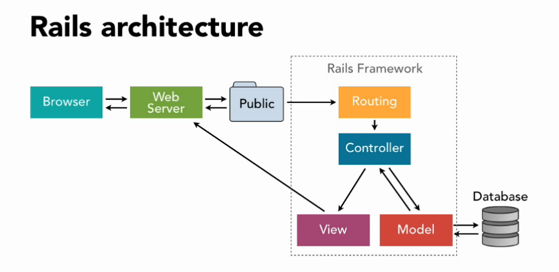

# Week 03 Notes:

#### Query Params
```
• ? denotes the beginning of the query parameters
• = indicates an assignment; anything to the left is the key,
    while the right represents the value
• & allows for the input of multiple parameters, separating each
```

#### Creates index.json.jb & show.json.jb

Add the gem to the Gemfile: gem 'jb'
```
rails generate jb <Name>
```


<br><br>

#### Database Viewer
```
brew install postico
```

## Add columns to Databases
```
rails generate migration <AddNameToObject> part_number:string
```
#### Add attribute
```
def change
  add_column :books, :name, :string
end
```
#### Migrate DB
```
rails db:migrate
```
#### Remove attribute
```
rails generate migration <RemoveNameFromObject> part_number:string
rails db:migrate
```
## Data Types
##### String:
Limited to 255 characters (depending on DBMS)
Use for short text fields (names, emails, etc)
##### Text:
Unlimited length (depending on DBMS)
Use for comments, blog posts, etc. General rule of thumb: if it's captured via textarea, use Text. For input using textfields, use string.
##### Integer:
Whole numbers
##### Float:
Decimal numbers stored with floating point precision
Precision is fixed, which can be problematic for some calculations; generally no good for math operations due to inaccurate rounding.
##### Decimal:
Decimal numbers stored with precision that varies according to what is needed by your calculations; use these for math that needs to be accurate
See this post for examples and an in-depth explanation on the differences between floats and decimals.
##### Boolean:
Use to store true/false attributes (i.e. things that only have two states, like on/off)
##### Binary:
Use to store images, movies, and other files in their original, raw format in chunks of data called blobs
##### primary_key:
This datatype is a placeholder that Rails translates into whatever primary key datatype your database of choice requires (i.e. serial primary key in postgreSQL). Its use is somewhat complicated and not recommended.
Use model and migration constraints (like validates_uniqueness_of and add_index with the :unique => true option) instead to simulate primary key functionality on one of your own fields.
##### Date:
Stores only a date (year, month, day)
##### Time:
Stores only a time (hours, minutes, seconds)
##### DateTime:
Stores both date and time
##### Timestamp:
Stores both date and time
Note: For the purposes of Rails, both Timestamp and DateTime mean the same thing (use either type to store both date and time). For the TL;DR description of why both exist, read the bottom paragraph.

#### Seed Dump Gem
https://github.com/rroblak/seed_dump
```
gem install seed_dump
```
<p align="center">or</p>

```
gem 'seed_dump' (to Gem file)
```
```
rails db:seed:dump
```

### links:
##### Guide: Rails migrations
https://github.com/actualize-chi-2022-05/resources/blob/main/guide_rails_migrations.md
